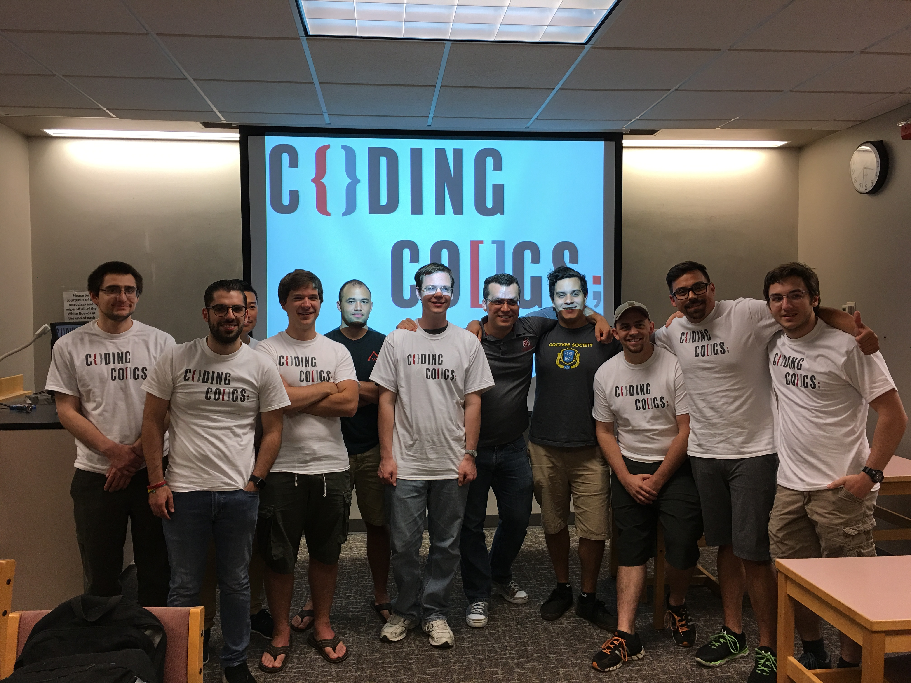

# Coding Cougs
* Link to the Slides

---

## Who we are?

* Jiro Farah -- President 
* Haiden Deaton -- Vice President

---

## Our Vision
* To foster a culture of learning within the Computer Science community of the Tri-Cities.
* A collaborative setting for computer science related disciplines.
* An environment to explore new skills. 
* Participate in small and large scale coding projects.
* Encourage members to seek out opportunities that will expand their knowledge.
* Organize talks and events by students, faculty and community guests.

---

## Events

---

## Join Us
* Become a member and [CougSync](https://orgsync.com/158673/chapter)

---

## Contact us
* [Slack Team](https://codingcougs.slack.com)

---

## Questions?

